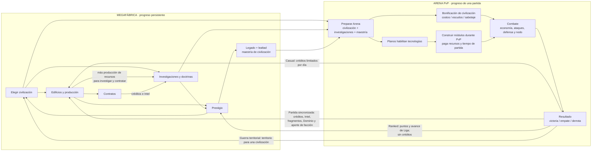

# Megafábrica, PvP y civilizaciones

Este mapa amplía [GAME_FLOW.md](GAME_FLOW.md) y se enfoca en el ciclo entre progreso persistente y combate. Refleja el código activo: la Megafábrica prepara la partida, el PvP devuelve recompensas y la civilización elegida modifica ambos lados.

## Mapa de ida y vuelta

## Qué pasa en cada dirección

### Megafábrica → PvP

- La civilización actual se usa para elegir la civilización del jugador al iniciar partidas de Liga y guerra territorial.
- Se envían a Arena las investigaciones, sus descripciones, la doctrina equipada y la maestría de la civilización.
- Las investigaciones de Arena desbloquean módulos o planos. El jugador todavía debe pagar recursos y tiempo para construir las mejoras durante el combate; investigar no las activa todas automáticamente.
- La doctrina de misil equipada modifica ataques específicos. Solo una doctrina puede estar activa.
- Los edificios alimentan el progreso persistente y permiten obtener recursos para investigar. No se copian como niveles de edificios de combate en las partidas normales; hay un perfil de fábrica reservado para simulaciones.

### PvP → Megafábrica

- Las partidas casuales pueden dar créditos: 40 por victoria, 25 por empate y 12 por derrota, con un máximo de 10 recompensas diarias.
- Las partidas sincronizadas pueden devolver créditos, Intel, fragmentos, Dominio y aporte de facción; Arena comunica esa recompensa a la pantalla de Imperio.
- Ranked actualiza puntos, rating, historial y avance de Liga; el flujo actual indica que no da créditos.
- Las guerras territoriales actualizan el control territorial de la civilización ganadora.
- El Imperio suma Dominio por resultado: la base es 36 por victoria, 14 por empate y 6 por derrota; la civilización modifica esa ganancia. El Dominio progresa la maestría de guerra.

### Civilización → ambos sistemas

| Civilización | Megafábrica | Efecto PvP base | Efecto PvP por maestría |
| --- | --- | --- | --- |
| Forja | Edificios cuestan 10% menos. | Mejoras económicas cuestan 7% menos; ataques cuestan 8% más. | Cada punto de maestría reduce 0,5 puntos porcentuales el costo económico, hasta 10 puntos. |
| Bastión | Producción persistente +8%. | Escudos absorben 14% más; economía de Arena cuesta 6% más. | Cada punto agrega 0,5 puntos porcentuales a la resistencia, hasta 5 puntos. |
| Enjambre | Contratos duran 10% menos. | Ataques cuestan 12% menos; defensas cuestan 12% más. | Cada punto reduce 0,5 puntos porcentuales el costo de ataque, hasta 5 puntos. |
| Nexo | Investigaciones cuestan 10% menos. | Sabotaje cuesta 26% menos; ataques cuestan 4% más. | Cada punto reduce 0,5 puntos porcentuales el costo de sabotaje, hasta 5 puntos. |

La maestría PvP se calcula con Legado de esa civilización + Lealtad, con tope de 10. El prestigio aumenta el Legado de la civilización anterior; repetirla también aumenta Lealtad, y migrar entrega una parte de Lealtad a la nueva.

La civilización también modifica la ganancia de Dominio del resultado PvP: Forja +12%, Bastión +8%, Enjambre +10% y Nexo +14%. Este multiplicador afecta la recompensa persistente, no el daño del combate.

## Archivos que implementan el circuito

| Responsabilidad | Archivo activo |
| --- | --- |
| Elegir civilización, edificios, investigación, prestigio y recompensas | `public/game/adapters/web/empire-controller.js` |
| Bonos de fábrica, costos de investigación y progreso | `public/game/domain/empire/catalog.js`, `economy.js`, `progression.js` |
| Estadísticas base de civilizaciones y balance Arena | `public/game/domain/arena-config.js` |
| Enviar progreso persistente al iframe y recibir resultados | `public/game/adapters/web/empire-controller.js` |
| Incorporar investigaciones a la partida y habilitar tecnologías | `public/game/adapters/web/arena-tech.js`, `arena-core-runtime.js` |
| Aplicar bonos de civilización y maestría al combate | `public/game/adapters/web/arena-balance-overrides.js` |
| Resolver efectos de módulos, doctrina y producción PvP | `public/game/adapters/web/arena-production-system.js` |
| Sincronizar recompensa online de Arena | `public/game/adapters/persistence/arena-online.js` |

Las reglas de combate de Arena todavía están distribuidas en extensiones históricas del adaptador web; este mapa describe cómo funciona hoy, no una separación final por sistemas de dominio.
