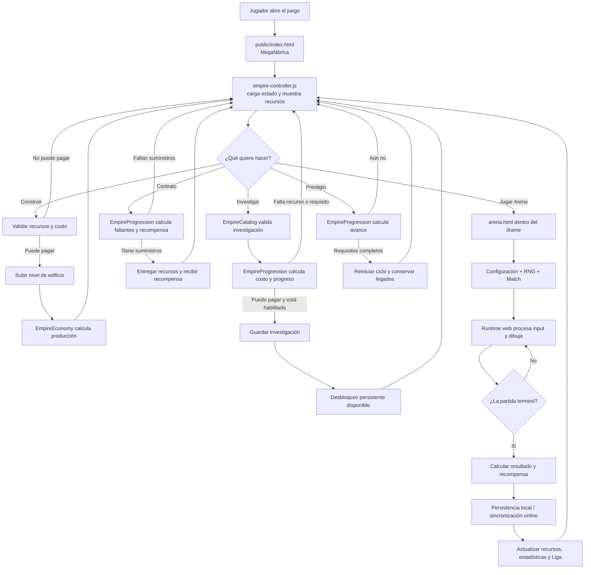
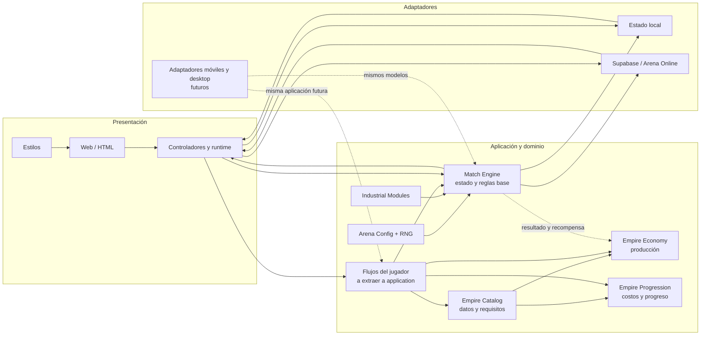

# Cómo se desarrolla Factory Wars

Este mapa muestra el recorrido del jugador y cómo se conectan las partes activas del código. La vista de red es una metáfora para explicar las dependencias y los ciclos de progreso; el juego no usa una red neuronal para decidir las reglas.

## Recorrido de una sesión

## Red de dependencias

Las flechas muestran qué componente aporta datos o decisiones al siguiente. La realimentación Arena → Megafábrica representa las recompensas que permiten nuevas mejoras y partidas.

## Decisiones principales del jugador

| Decisión | Condición | Efecto |
| --- | --- | --- |
| Construir edificio | Recursos suficientes | Aumenta capacidad y producción persistente. |
| Investigar | Intel, requisitos y cupo disponibles | Desbloquea tecnologías para Imperio o Arena. |
| Completar contrato | Reunir los recursos solicitados | Convierte suministros en créditos, intel y progreso. |
| Entrar en Arena | Elegir una partida y civilización | Inicia combate contra bots u otros jugadores según el modo. |
| Elegir acción de combate | Recursos y reglas de partida lo permiten | Cambia economía, defensa, ataque o control del nodo. |
| Subir de prestigio | Completar las metas del ciclo | Reinicia parte del progreso y conserva beneficios de legado. |

## Cómo leerlo para desarrollar

1. Para cambiar una regla persistente, empezar por `public/game/domain/empire/`.
2. Para cambiar una regla de combate base, empezar por `public/game/domain/arena/match-engine.js`.
3. Para cambiar interacción o presentación web, revisar `public/game/adapters/web/` y `public/game/presentation/`.
4. Para cambiar guardado o sincronización, revisar `public/game/adapters/persistence/` y `supabase/`.
5. Antes de añadir una plataforma, conectar su adaptador a las reglas compartidas; no duplicar el motor.

Algunas reglas de Arena y flujos de Imperio todavía viven en controladores/extensiones históricos. La arquitectura objetivo y ese trabajo pendiente están descritos en [ARCHITECTURE.md](ARCHITECTURE.md) y [MIGRATION_PLAN.md](MIGRATION_PLAN.md).

Para ver el ida y vuelta detallado entre Megafábrica, PvP y civilizaciones, abrir [FACTORY_PVP_CIVILIZATIONS.md](FACTORY_PVP_CIVILIZATIONS.md).
