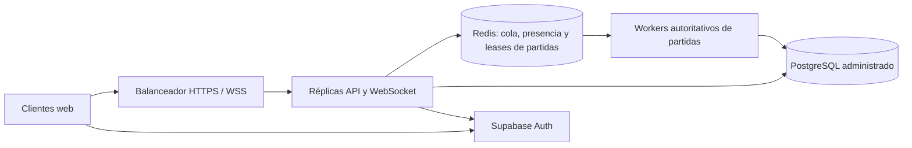

# Factory Wars Online · prueba local y despliegue portable

Esta entrega agrega una API Node, autenticación Supabase, PostgreSQL, una Liga compartida (12 lugares por defecto, configurable) con bots, comandos de Megafábrica validados por servidor y partidas Arena con estado/eventos guardados. Solo PvP humano contra humano cambia Elo, puntos y récord competitivo; las partidas de relleno contra bots guardan resultado y telemetría, pero no alteran la clasificación. La pantalla online está en `/online.html`; el juego local anterior sigue disponible en `/`.

En una partida, `/online.html` abre la Arena 3D existente dentro del portal. La interfaz presenta tu fábrica del lado A, aunque en la partida seas el lado B; los botones y las mejoras se envían a la API y la simulación solo avanza en el servidor.

## Reglas de Arena online

El servidor carga el motor compartido `public/game/domain/arena/match-engine.js` y las capas de reglas que usa `arena.html`: módulos industriales, producción por colas, balance, investigaciones de Megafábrica, guardianes, tecnologías y bots. Los límites `FACTORY_WARS_HEADLESS_RULES_END` en esos adaptadores marcan el código de reglas que se ejecuta en Node; el código visual del navegador no se evalúa en el servidor. Se guarda la versión `arena-online-1.7` en cada partida. Ataques, defensas, producción, módulos, nodo y acciones especiales pasan por validación autoritativa.

La Megafábrica online ejecuta del lado servidor las reglas compartidas de `domain/empire/`. El cliente envía comandos; no envía el saldo final que se guardará. Los saves antiguos de navegador no se importan por defecto. Hay un importador opcional y desactivado por configuración: copia solo recursos, edificios, investigaciones y legado dentro de límites; descarta campos desconocidos y reinicia cualquier contrato que estuviera en curso. La cola de producción, los módulos, tecnologías y cantidades de guardianes de Arena se validan en el servidor.

El gestor de partidas vive en una sola instancia Node. PostgreSQL conserva cuentas, fábricas, Liga, resultados y eventos. Un bloqueo de sesión de PostgreSQL evita que dos procesos usen la misma base para ejecutar partidas en esta beta; el segundo servidor se detiene antes de modificar el estado. Si se recarga el navegador o se corta su conexión, el mismo servidor permite volver a la cola o a la partida activa. Los eventos de Arena se escriben cada `MATCH_EVENT_PERSIST_INTERVAL_MS` (5 segundos por defecto), al aceptar acciones y durante un apagado limpio. Reiniciar el proceso cierra las partidas que quedaron abiertas; un cierre abrupto puede perder eventos del último intervalo y el estado activo no se reanuda. Para varias instancias simultáneas habrá que reemplazar el bloqueo por un coordinador compartido para presencia, cola y partidas activas (por ejemplo Redis), y ejecutar pruebas de carga antes de declarar capacidad para 1.000 usuarios.

## Requisitos

- Windows 10/11 con Docker Desktop y WSL 2 habilitados.
- Conexión a Internet durante el primer `docker compose up --build`: Docker descarga la imagen base de Node y npm instala las dependencias del servidor. Los siguientes inicios pueden reutilizar las imágenes ya descargadas.
- Una conexión a un proyecto de Supabase para Auth. En **Authentication → Sign In / Providers**, habilitá los usuarios anónimos para la prueba. Cada navegador crea una cuenta anónima distinta.
- Node.js no es necesario para la ejecución documentada con Docker. El comando opcional `npm run dev` requiere además instalar las dependencias del servidor y configurar sus variables de entorno para una base PostgreSQL accesible desde Windows.

## Preparar Supabase Auth

Para cinco jugadores, usá un proyecto de Supabase administrado mientras el servidor del juego corre en tu PC. En el Dashboard, copiá `Project URL` y la publishable key (o anon key histórica). Habilitá **Anonymous Sign-Ins**. El navegador solo recibe esa clave pública; no uses `service_role` en `config.js`, HTML ni en el navegador.

El portal permite conservar el progreso al vincular la cuenta anónima a un correo. Para eso, habilitá también el proveedor Email y el vínculo manual de identidades en Supabase. El flujo sigue el [proceso oficial para convertir cuentas anónimas](https://supabase.com/docs/guides/auth/auth-anonymous): primero vincula el correo; si el proveedor exige confirmarlo, confirmalo y volvé al portal antes de guardar la contraseña. La configuración local desactiva esa confirmación para facilitar las pruebas. En **Authentication → URL Configuration**, agregá `http://localhost:8080/online.html` a las URL de redirección permitidas; para una prueba en LAN, agregá también la dirección que usarán los jugadores. Si el correo ya pertenece a otra cuenta, iniciá sesión con esa cuenta: el perfil anónimo actual no se fusiona. El mismo portal permite pedir un enlace de recuperación y guardar una contraseña nueva después de abrirlo.

También se puede usar Supabase local con CLI para probar en una sola PC. Instalá Supabase CLI y el runtime Docker siguiendo la [guía oficial de desarrollo local](https://supabase.com/docs/guides/local-development); después ejecutá `npx supabase start` desde la raíz. `supabase/config.toml` habilita Auth anónimo, email y vínculo manual; `npx supabase status -o env` muestra URL y claves locales. Esa pila local es para desarrollo; no la publiques a Internet.

## Preparar el servidor

En PowerShell, desde la raíz del repositorio:

```powershell
Copy-Item .env.online.example .env.online
notepad .env.online
```

Completá `SUPABASE_URL` y `SUPABASE_ANON_KEY`. Con Supabase administrado, usá la URL HTTPS de tu proyecto en `SUPABASE_URL` y `SUPABASE_BROWSER_URL`. Para Supabase local, el servidor dentro de Docker usa `http://host.docker.internal:54321`; el navegador en la misma PC usa `http://localhost:54321`.

Generá `POSTGRES_PASSWORD` en PowerShell y pegá el resultado en `.env.online`:

```powershell
$bytes = New-Object byte[] 24
$rng = [System.Security.Cryptography.RandomNumberGenerator]::Create()
$rng.GetBytes($bytes)
$postgresPassword = [BitConverter]::ToString($bytes).Replace('-', '').ToLowerInvariant()
$rng.Dispose()
$postgresPassword
```

El compose crea PostgreSQL local y aplica `supabase/online_schema.sql`; el servidor también aplica el esquema al iniciar. Guardá `.env.online` fuera de Git.

Iniciá los contenedores:

```powershell
docker compose --env-file .env.online -f docker-compose.online.yml up --build
```

Abrí `http://localhost:8080/online.html`. El endpoint `http://localhost:8080/api/v1/health` debe responder `status: ok` y `database: true`. Para probar cinco jugadores desde una sola PC, abrí cinco perfiles de navegador distintos (o combiná Chrome, Edge y Firefox); las pestañas normales del mismo perfil comparten la cuenta anónima. Para detenerlo, usá `Ctrl+C` y luego:

```powershell
docker compose --env-file .env.online -f docker-compose.online.yml down
```

## Exportar los datos de todos los jugadores

El exportador personal descarga solo los datos de la cuenta actual. Para habilitar el exportador de temporada, copiá el UUID que aparece en el encabezado del portal, agregalo a `.env.online` como `ADMIN_USER_IDS=<UUID>` y recreá el servidor con `docker compose --env-file .env.online -f docker-compose.online.yml up -d --build game-server`. Podés permitir varios administradores separando sus UUID con comas. El servidor vuelve a validar ese permiso en cada descarga; no se confía en el botón del navegador.

El botón **DESCARGAR DATOS DE TODA LA TEMPORADA** reúne en un JSON todas las fábricas y perfiles, roster y ranking, partidas completas o abandonadas con participantes e informes, todos los eventos del motor y eventos económicos. La API entrega páginas con una fecha de corte común. `exportFormatVersion` identifica el formato del archivo; cada partida conserva su `ruleset_version` y cada evento su `eventVersion`. El archivo incluye UUID seudónimos y datos de todos los jugadores: guardalo como información privada, fuera del repositorio.

Los datos de PostgreSQL quedan en el volumen Docker `factory_wars_db`; `down` lo conserva. No agregues `-v` salvo que quieras borrar la base local.

## Respaldar la base y moverla

Con el stack iniciado, generá un dump PostgreSQL en formato comprimido y copialo a la carpeta del proyecto:

```powershell
docker compose --env-file .env.online -f docker-compose.online.yml exec -T db pg_dump -U factory_wars -d factory_wars -Fc -f /tmp/factory-wars.dump
docker compose --env-file .env.online -f docker-compose.online.yml cp db:/tmp/factory-wars.dump .\factory-wars.dump
```

Guardá ese archivo fuera de Git: incluye perfiles, economía y telemetría de los jugadores. Para restaurarlo en una base PostgreSQL destino, la base no debe tener ya las tablas `online_*`: el dump incluye el esquema y los datos. En PowerShell, pegá la URI de conexión de destino cuando se solicite; Docker ejecuta `pg_restore` sin instalar el cliente PostgreSQL en Windows:

```powershell
$secureUri = Read-Host "URI de PostgreSQL destino" -AsSecureString
$credential = New-Object -TypeName System.Net.NetworkCredential -ArgumentList @('', $secureUri)
$env:FW_TARGET_DATABASE_URL = $credential.Password
try {
  docker run --rm --mount "type=bind,source=$((Resolve-Path .).Path),target=/backup,readonly" -e FW_TARGET_DATABASE_URL postgres:17-alpine sh -c 'pg_restore --no-owner --no-acl --dbname="$FW_TARGET_DATABASE_URL" /backup/factory-wars.dump'
  if ($LASTEXITCODE -ne 0) { throw "pg_restore falló con código $LASTEXITCODE" }
} finally {
  Remove-Item Env:FW_TARGET_DATABASE_URL -ErrorAction SilentlyContinue
  Remove-Variable secureUri -ErrorAction SilentlyContinue
  Remove-Variable credential -ErrorAction SilentlyContinue
}
```

Para restaurar el dump, `pg_restore` usa libpq y acepta los parámetros TLS que indique el proveedor, por ejemplo `sslmode=require`. Para el servidor Node, configurá `DATABASE_URL_OVERRIDE` en `.env.online` con una URI de PostgreSQL **sin** `sslmode`, `sslcert`, `sslkey` ni `sslrootcert`, y activá `DATABASE_SSL=true`; Compose la entrega como `DATABASE_URL` al contenedor y el cliente `pg` aplica TLS con validación del certificado (`rejectUnauthorized: true`). Node-postgres advierte que esos parámetros de la URI pueden reemplazar las opciones SSL configuradas por código cuando se combinan ambos mecanismos ([documentación oficial](https://github.com/brianc/node-postgres/blob/master/docs/pages/features/ssl.mdx)). La base Auth de Supabase es independiente de este dump: las cuentas anónimas y sesiones se administran en el proyecto Supabase configurado.

## Comprobar la partida con cinco usuarios

1. Abrí cinco perfiles de navegador aislados y entrá en `/online.html` en cada uno. Cada perfil debe mostrar un ID de jugador distinto.
2. Elegí un nickname distinto y una civilización. Repartí las cuatro civilizaciones entre los perfiles para que el emparejador pueda formar dos partidas humanas; los jugadores que queden sin rival reciben un bot al vencer `BOT_FILL_DELAY_MS`.
3. Uní cada perfil a la Liga y pulsá **BUSCAR RIVAL** en los cinco dentro de los 12 segundos predeterminados de `BOT_FILL_DELAY_MS`. La Arena debe aparecer en los perfiles emparejados; si alguno espera más, recibe una partida contra bot.
4. En una partida, emití órdenes desde los dos perfiles y comprobá que ambos ven avanzar el mismo reloj, núcleo, nodo y fabricación. Recargá uno de los navegadores: debe volver a la misma partida. El saldo privado del rival debe mostrarse oculto.
5. Al terminar, las partidas deben quedar guardadas y el servidor debe acreditar Créditos, Intel, Fragmentos y Dominio según victoria/empate/derrota. Solo PvP humano contra humano cambia Elo, puntos y récord competitivo; el relleno contra bots conserva resultado, recompensa y telemetría sin modificar la clasificación.
6. En cada perfil, pulsá **VER MIS ESTADÍSTICAS** y **DESCARGAR TELEMETRÍA JSON**. El archivo incluye todo el historial propio de partidas, eventos del motor y eventos económicos de esa cuenta; el navegador reúne páginas acotadas bajo una misma fecha de corte.

## Conectar cinco equipos en la misma red

1. En `.env.online`, poné `GAME_SERVER_BIND=0.0.0.0`.
2. Averiguá la IPv4 privada de tu PC con `ipconfig`, por ejemplo `192.168.1.25`.
3. Poné `ALLOWED_ORIGINS=http://192.168.1.25:8080` y reiniciá Compose.
4. Permití el puerto TCP 8080 en el Firewall de Windows para la red privada.
5. Los otros jugadores abren `http://192.168.1.25:8080/online.html` desde la misma Wi-Fi.

Usá Supabase administrado para Auth en esa prueba de LAN: cada navegador llega al proyecto por HTTPS, y tu PC solo sirve el juego/API y la base local. El servidor guarda las partidas en tu PC; la autenticación queda en Supabase. Para jugadores por Internet hace falta un endpoint HTTPS público y una forma segura de alcanzar tu PC o un servidor; no uses el puerto HTTP de prueba como despliegue público.

## Cambiar la base local por Supabase Postgres

Para migrar los datos existentes, restaurá el dump en una base PostgreSQL destino vacía; el dump ya incluye el esquema, así que no ejecutes `online_schema.sql` por separado. Si vas a iniciar una base nueva sin datos históricos, aplicá `supabase/online_schema.sql` en SQL Editor. El dump de la aplicación no incluye las identidades de Supabase Auth. Para conservar el acceso de los jugadores, mantené el mismo proyecto Auth; si también vas a cambiarlo, planificá la migración de identidades antes de cambiar `SUPABASE_URL`, porque los registros del juego están asociados al UUID de cada cuenta. Después cambia `DATABASE_URL_OVERRIDE` en `.env.online` para que use una conexión directa o un pooler de modo sesión. El servidor mantiene un bloqueo PostgreSQL durante todo el proceso; el pooler de modo transacción no conserva bloqueos de sesión. En Supabase, usá el puerto 5432 para el modo sesión; el puerto 6543 corresponde al modo transacción y no sirve para esta versión. Consultá la [guía oficial de conexiones Supabase](https://supabase.com/docs/guides/database/connecting-to-postgres). Quitá de la URI los parámetros `sslmode`, `sslcert`, `sslkey` y `sslrootcert`, y usá `DATABASE_SSL=true` para que Node aplique TLS con validación del certificado. No cambies las rutas ni reglas del servidor. Mantené la cadena con usuario de servidor protegida en el entorno, nunca enviada al navegador.

La Liga admite configurar una plantilla de 1.000 lugares sin tocar reglas: cambia `SEASON_ROSTER_SIZE=1000` y `SEASON_ID` para crear una temporada nueva. `MAX_WEBSOCKET_CONNECTIONS` limita nuevas conexiones en una instancia (1200 por defecto); `PLAYER_ACTIONS_PER_SECOND` y `PLAYER_ACTION_BURST` limitan acciones de Arena por jugador (12/s con una ráfaga de 20 por defecto); `PLAYER_HTTP_REQUESTS_PER_MINUTE` limita el resto de las rutas autenticadas (300 por defecto); `MATCH_TICK_INTERVAL_MS` (200 ms) controla cuánto trabajo de simulación hace cada instancia, `STATE_BROADCAST_INTERVAL_MS` (250 ms) controla cada cuánto manda snapshots a los clientes, y `MATCH_EVENT_PERSIST_INTERVAL_MS` (5 s) controla el guardado por lotes de eventos durante la partida. Son mandos de configuración, **no una prueba de capacidad**. Esto solo prepara la plantilla, los límites y los intervalos; **no significa que esta instancia haya sido probada para 1.000 conexiones simultáneas**. La cola y las partidas activas aún viven en memoria en un solo proceso. Antes de escalar a esa carga habrá que agregar Redis para cola/presencia y coordinación de partidas, ejecutar pruebas de carga y dimensionar PostgreSQL/servidores (`DB_POOL_MAX` permite ajustar el pool por instancia). Medí la latencia y el atraso de simulación antes de cambiar los intervalos en una instancia de producción. La lógica de partida y la API se mantienen; esa etapa reemplaza la coordinación del proceso.

## Datos que quedan guardados

- **online_profiles:** identidad y nickname.
- **online_empires:** estado versionado de la Megafábrica y revisión para escrituras concurrentes.
- **online_seasons / online_season_players:** temporada común, humanos, bots, rating y puntos.
- **online_matches / online_match_participants:** configuración, semilla, resultado, tiempo de espera de cola y estadísticas por participante.
- **online_match_events:** acciones y muestras de estado del motor, incluidas acciones rechazadas; se siguen exportando los eventos de partidas abandonadas.
- **online_economy_events:** contratos, mejoras, investigación, prestigio, recompensas de partida y producción pasiva agregada cuando se acumulan al menos 60 segundos. Si el jugador estuvo desconectado, una actualización puede agrupar un intervalo mayor; cada avance acredita como máximo cuatro horas.

En el informe de cada participante se guardan resultado y rating antes/después; valores finales de banco, ingreso, vida, nivel, escudos y módulos; gasto económico, militar, defensivo, de sabotaje, territorial y tecnológico; daño causado/recibido; ataques, defensas, capturas, sabotajes, mejoras y órdenes de fábrica; utilización de líneas, trabajos terminados, banco máximo, pérdidas por apilado de escudos; y telemetría de órdenes, decisiones agrupadas, decisiones estratégicas, entradas inválidas, amenazas y espera en cola. Las muestras `state_sample` conservan evolución temporal de banco, ingreso, vida, escudos, nivel, gastos y control territorial; los demás eventos registran órdenes y resoluciones concretas, con su tiempo de Arena y payload.

Cada partida guarda `ruleset_version` y semilla para identificar las reglas y la aleatoriedad usadas. Los JSON de análisis incluyen `exportFormatVersion`; los eventos incluyen `eventVersion`. El export personal reúne la fábrica propia, partidas propias y sus eventos, más eventos económicos propios. El export de administrador reúne perfiles, roster, todas las partidas/eventos y economía de toda la temporada, con UUID persistentes de Auth; tratá esos archivos como datos privados.

La API exige un token Supabase válido antes de cada lectura o escritura; el navegador no recibe credenciales de base de datos. El panel de Arena resume resultados y permite descargar un JSON con el estado actual de tu Megafábrica, todo el historial de partidas propias y sus eventos ordenados e informes, y todos tus eventos económicos. La API los entrega en páginas acotadas y el navegador las reúne en un solo archivo. Los IDs de usuario son UUID seudónimos de Auth. Una cuenta anónima no se recupera al borrar sus datos del navegador; desde el portal podés vincularla a un correo, confirmarlo si el proveedor lo requiere y definir una contraseña para iniciar sesión en otros navegadores.

## Arquitectura objetivo para nube

La prueba local corre un solo proceso Node. Para escalar, se conserva el motor de Arena y la API; se reemplaza el coordinador en memoria por servicios compartidos y se separan los workers que avanzan partidas:



Redis debe asignar cada partida a un worker propietario y distribuir acciones y snapshots entre réplicas; PostgreSQL sigue guardando perfiles, imperios, temporadas, resultados y eventos. Antes de aumentar réplicas, hace falta implementar esa coordinación, medir uso de CPU, memoria, conexiones y atraso de ticks, y probar al menos 1.000 conexiones con partidas activas. El límite de sockets y las opciones de frecuencia actuales solo permiten ajustar una instancia; no reemplazan esos pasos.
